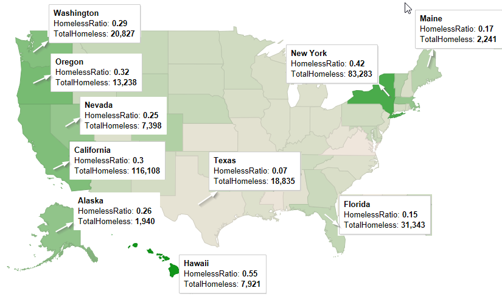
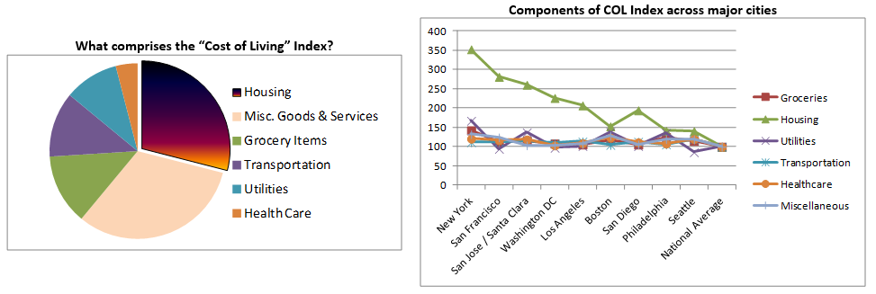

```{r setup, include=FALSE}
knitr::opts_chunk$set(echo = TRUE)
```

```{r, echo=FALSE, message=FALSE}
require(dplyr)
require(stringr)
require(stringi)
require(ggmap)

#function definition to extract from string
substrRight <- function(x, n){
  substr(x, nchar(x)-n+1, nchar(x))
}
```

## Homelessness in United States - A Study

This is an analysis on a public dataset on homelessness across United States, downloaded from HUD website. For the scripts / datasets, please visit <http://github.com/susub31/Homelessness-Analysis>.

Analysis revealed that Hawaii had the highest homeless ratio (number of homeless people relative to the State's population) in the country.  The number of people homeless in Hawaii may not seem like a high number compared to the number of homeless people in California or New York.  Considering the percentage of people who are homeless relative to the population in the state, it paints an alarming picture as shown below.

#### Homeless Ratio Map:  
 

\newpage
## Understanding Cost of Living

Let’s first understand what makes up the “Cost of Living” (COL) Index.  Housing forms a major component, as it attributes to 30% of the COL Index.  Looking at the factors that comprise the COL Index for the top 10 cities with high counts of homelessness, we can infer that the index for housing is higher than all other factors.

 

As seen above, housing index in these 10 cities with high counts of homelessness is much higher than the national average, compared to all other components.  And, overall COL Index is higher in these cities by anywhere from 21% to 99%.  New York City has the highest index across most factors and overall cost of living index as well.   As seen above, the Housing index is 250% higher in New York City compared to the national average across 325 cities.  This explains the correlation we see between homelessness and cost of living in the cities.  Tackling housing at these cities will indirectly help tackle homelessness.  

\newpage
## Homeless Counts
“Point-in-time” surveys are taken periodically to track counts of homeless people periodically.  This information is very useful to understand spread of homelessness across all States.  It also feeds information to the Department of Housing and Urban Development to determine funding for cities and other initiatives that need to be taken to reduce homelessness.

Plotting the count of homeless people (adults, veterans and youth) for the top 35 continuums (CoC) with high counts of homelessness, paints the following picture, where size of the bubble indicates high count of homelessness.

```{r echo=FALSE, message=FALSE}
#Read the dataset that has the CoC GeoCodes, so that it can be linked into other datasets
cocgeocodes <- read.csv("../Datasets/COCNumWithGeoCodes.csv")

#Read Homeless dataset, that has info on shelter beds etc. across all CoCs
HomelessData <- read.csv("../Datasets/CoCGranteeAreasWithGeoCodes2.csv")

#Filter to compile dataset that are Balance of State vs. other jurisdictions
BOSHomelessData <- filter (HomelessData, str_detect(COCNAME, 'Balance of State'))
NonBOSHomelessData <- filter(HomelessData, !str_detect(COCNAME, 'Balance of State'))

#Read dataset that lists # of homeless adults, veterans and youth 
hdata <- read.csv("../Datasets/HomelessData2016_Mod.csv")
hdata$lon = NULL
hdata$lat = NULL

#Merge Lat and Lon details from CoCGeoCodes dataset; capture only non-Balance of State jurisdictions
hdata <- merge(hdata, cocgeocodes, by.x="CoCNumber", by.y="COCNUM")
hdata <- filter(hdata, !str_detect(CoCName, 'Balance of State'))
#hdata <- hdata %>% na.omit()
hdata <- filter (hdata, !is.na(hdata$lat))
hdata$region = substr(hdata$CoCNumber, 1, 2)

#Read the US Map
usa_center = as.numeric(geocode("United States"))
USAMap = get_googlemap(center=usa_center, scale=2, zoom=4)

#Use this to see where there are higher homeless counts
hdatatop35 <- tbl_df(hdata) %>% 
  top_n(35, TotalHomeless2016)

#Homeless veterans
hvdatatop35 <- tbl_df(hdata) %>% 
  top_n(35, HomelessVeterans2016)

#Homeless youth under age of 25
hyouthtop35 <- tbl_df(hdata) %>% 
  top_n(35, HomelessUnder25Youth2016)

#ALL Homeless Counts
hdata$AllHomelessCounts = hdata$TotalHomeless2016 + hdata$HomelessVeterans2016 + hdata$HomelessUnder25Youth2016
AllHomelessTop35 <- tbl_df(hdata) %>% 
  top_n(35, AllHomelessCounts)

#Exclude Hawaii, so that the US map shows up better
hdatatop35 <- subset(hdatatop35, !(region == "HI"))
hvdatatop35 <- subset(hvdatatop35, !(region == "HI"))
hyouthtop35 <- subset(hyouthtop35, !(region == "HI"))
AllHomelessTop35 <- subset(AllHomelessTop35, !(region == "HI"))

COLByCities <- read.csv("../Datasets/COL_ByCities.csv")
COLByCities$UrbanArea <- gsub(", ", " ", COLByCities$UrbanArea)

COLByCities$State <- COLByCities$UrbanArea
COLByCities$State <- substrRight(COLByCities$State, 2)
COLByCities <- group_by(COLByCities, State)
COLByCities <- summarise(COLByCities, COLStateAvg=mean(COLIndex), HousingIndex=mean(Housing))

```

```{r include=FALSE, cache=FALSE, echo=FALSE, message=FALSE}
us <- map_data("state")
usstates <- read.csv("../Datasets/StateNames.csv")
usstates <- usstates %>%
  add_rownames("region") %>%
  mutate(region=tolower(StateName))

# Merge US States and Cost of Living by cities datasets for color-coding the US Map
usstates$StateName=NULL
usstates <- merge(usstates, COLByCities, by.x="State", by.y="State")

#Plot a blank US Map
BlankUSMap <- ggplot()
BlankUSMap <- BlankUSMap + geom_map(data=us, map=us,
                                    aes(x=long, y=lat, map_id=region), 
                                    fill="white", color="black")

#US Map, color coded based on the COL Index in the state
COLMap <- BlankUSMap + geom_map(data=usstates, map=us, 
                                      aes(fill=HousingIndex, map_id=region), color="#ffffff", size=0.15) 

COLMap <- COLMap + scale_fill_continuous(low='gray89', high='thistle3', guide='colorbar')

COLMap <- COLMap + labs(x=NULL, y=NULL) + 
  theme(panel.border = element_blank()) + 
  theme(panel.background = element_blank()) +
  theme(axis.ticks = element_blank()) + 
  theme(axis.text = element_blank())
#COLMap

#draw map of the United States, filled based on Housing Index
homelessmap <- COLMap + 
  geom_point(aes(x=lon, y=lat, size=AllHomelessCounts, colour="red", alpha=0.8), data=AllHomelessTop35) + 
  labs(x='Longitude', y='Latitude') +
  ggtitle("Homeless Counts by CoC (Top 35)") +
  scale_size_continuous(name="Homeless Counts", range = c(2,12), guide = FALSE) +
  scale_alpha(guide=FALSE) +
  scale_colour_discrete(guide=FALSE)
# use this to remove all legends
#  theme(legend.position="none")

homelessmap <- homelessmap + labs(x=NULL, y=NULL) + 
  theme(panel.border = element_blank()) + 
  theme(panel.background = element_blank()) + 
  theme(axis.ticks = element_blank()) + 
  theme(axis.text = element_blank())
```

```{r echo=FALSE, message=FALSE}
homelessmap
```

## Initial Analysis

Ranking the continuums based on descending order of counts of homeless people (which includes adults, veterans and youth) reveals some interesting facts: 

*	Four out of top 10 continuums are in California.  Interestingly, the number of homeless people in New York City CoC is higher than the total across these four continuums in California with high counts of homeless people.
*	Ten out of top 35 continuums are in California.  Cost of Living Index in 9 out of these 10 cities is higher than national average by anywhere from 20% to 100%, averaging at around 150%.
*	Count of homeless people in these 10 continuums which rank in the top 35 is much higher than the count of homeless people in New York City continuums.
*	Cities listed among top 10 continuums with high counts of homeless people are major metropolitan cities including New York City, Los Angles, Seattle, San Francisco etc.
*	New York City, which tops this list in count of homeless people, has a Cost of Living Index that is twice the national average.


Plotting the top 35 continuums with high homeless counts in the respective categories (adults, veterans and youth) identifies continuums where homeless counts are high across all three categories as well as where one particular category dominates the others.  This is shown in the map below.

```{r echo=FALSE, message=FALSE}
# mapping TOP 35 jurisdictions based on counts of homeless Adults, Veterans and Youth in the same map
AdultsVetsHomelessMap <- COLMap +
  geom_point(aes(x=lon, y=lat, size=TotalHomeless2016, colour="Adults", alpha=0.8), data=hdatatop35) + 
  geom_point(aes(x=lon, y=lat, size=HomelessVeterans2016, colour="Veterans", alpha=0.8), data=hvdatatop35) +
  geom_point(aes(x=lon, y=lat, size=HomelessVeterans2016, colour="Youth", alpha=0.8), data=hyouthtop35) +
  scale_size_continuous(name="Homeless Count", range = c(2,10), guide=FALSE) +
  labs(x='Longitude', y='Latitude') +
  ggtitle("Homeless Counts by Category (Adults, Veterans, Youth)") +
  scale_alpha(guide=FALSE) +
  scale_colour_discrete(name="Category")
  #theme(legend.position="none")

AdultsVetsHomelessMap <- AdultsVetsHomelessMap + 
  labs(x=NULL, y=NULL) + 
  theme(panel.border = element_blank()) + 
  theme(panel.background = element_blank()) + 
  theme(axis.ticks = element_blank()) + 
  theme(axis.text = element_blank())
AdultsVetsHomelessMap
```